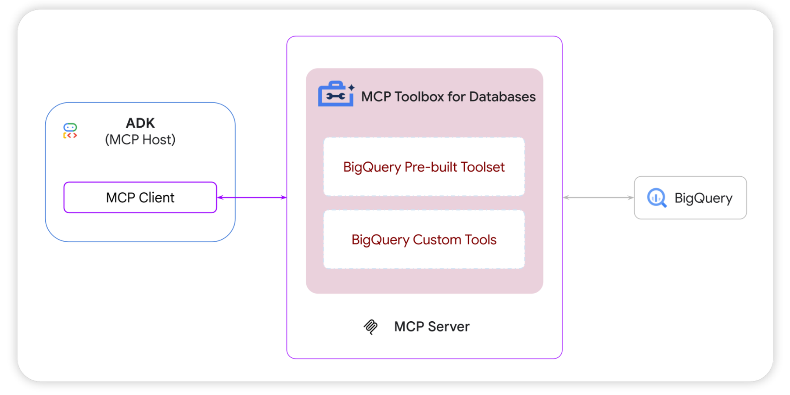

# Ad Performance Analysis Agent 



## Step by Step Guide:
[1] Make sure you add the following to your environment (you can use the attached .env file):
    - OPENAI_API_KEY
    - GOOGLE_CLOUD_PROJECT_ID
[Optional] Run configuration check by running the config file.

[2] Connect to your GCP account:
```bash
gcloud auth login
gcloud auth application-default login
```

[3] Run Ad Performance Analysis Agent

If you use your local environment, and run the Streamlit Dashboard with the following command.

```bash
pip install -r requirements.txt
streamlit run src/agent_app.py
```

[Optional] If you chose to use the Dockerfile - Note that it references an earlier (less fine) version and needs to be fixed before running.
  - [Optional] run command:
```bash
docker compose up --build
docker compose up --force-recreate
```
  - Open Streamlit dashboard: [Ad Performances Analysis Agent](http://localhost:8502)

If you want access to my GCP project, please contact me.


**GCP Project**
```
    Name: "Ad Performance Analysis Agent"
    ID: "ad-performance-analysis-agent"
```


## Input Dataset

`bigquery-public-data.google_analytics_sample.ga_sessions_*`

* Public BigQuery dataset.

* The format and schema of the Google Analytics data that is imported into BigQuery - [Documentation](https://support.google.com/analytics/answer/3437719?hl=en)


[**Google Analytics Sample**](https://console.cloud.google.com/marketplace/product/obfuscated-ga360-data/obfuscated-ga360-data) - Twelve months (August 2016 to August 2017) of obfuscated Google Analytics 360 data from the [Google Merchandise Store](https://merch.google/)


## The Task

**References**

- [BigQuery meets ADK & MCP: Accelerate agent development with BigQuery's new first-party toolset](https://cloud.google.com/blog/products/ai-machine-learning/bigquery-meets-google-adk-and-mcp) 

- [ADK Agents for BigQuery Series — Part 1: Build a baseline agent for BigQuery with ADK](https://medium.com/google-cloud/)adk-agents-for-bigquery-series-40de8cf4e3ca


### Part 1 - Data Preparation and Exploration


**Documents**

- [GA Sessions - BigQuery Export schema](https://support.google.com/analytics/answer/3437719?hl=en)
- [Google Analytics Sample](https://console.cloud.google.com/marketplace/product/obfuscated-ga360-data/obfuscated-ga360-data?project=ad-performance-analysis-agent)

- References:

  - [Analyzing Google Analytics Big Query Data to determine Market Demographics and Product Seasonality with SQL](https://medium.com/@lucadoehling/analyzing-google-analytics-big-query-data-to-determine-market-demographics-and-product-seasonality-18278b319e0e)

  - [How to work with Google Analytics data in BigQuery](https://medium.com/swlh/how-to-handle-google-analytics-data-in-bigquery-f4307062eada)


**Dates range:**
  - Start - August 2016: 08-2016 
  - End - August 2017: 08-2017


**Data Preparation**

- Data normalization - set zeros, null like expressions and "(not set)" to `null`

**Monthly data querying:**

- BigQuery 
  - Table ID: `ad-performance-analysis-agent.ga_sessions_data.data`
  - Query: [`ad-performance-analysis-agent.Queries.BASE_QUERY`](https://console.cloud.google.com/bigquery?ws=!1m7!1m6!12m5!1m3!1sad-performance-analysis-agent!2sus-central1!3s42fb8b6f-761d-49d0-8ea7-c401a1be27b5!2e1)

- Code: `/Users/netagindes/Repos/teads-home-assignment/data/queries.py`

**Next Step [Optional]**

- Enrich the agent input channeling other fields from the GA Sample data.


### Part 2 - Building the MCP Server

#### Tools
1. `get_monthly_data`: This tool should accept a month and a set of requested dimension columns and return a structured **JSON response** containing the calculated KPIs for these dimensions on this month (as described in the query above).

2. `get_all_data`: This tool should accept a set of requested dimension columns and return a structured **JSON response** containing the calculated KPIs for these dimensions on all the data.


### Part 3 - Building the Agent

#### Flagging Rules:

* **Traffic rule:** Avg. time on site < 120 seconds and total pageviews below 30
* **Conversion rule:** zero conversions and more than 250 pageviews

#### Agent Abilities:

1. *Compare between two months* what were the changes to the KPIs for all the dimensions requested by the user. Provide for each segment the percentage change in each KPI.

2. Given all the dimensions except user country, and a rule name (traffic or conversion) return all the *flagged segments*.

3. Return the *conversion rate* (total conversions / total visitors) for each user country on each device on a given month, ordered from highest to lowest.


### Part 4 - Building the Client Interaction
Build an AI Agent application that interacts with the MCP created in Part 2.

* Streamlit
* Dashboard


**Personal GCP Project**
```
    Name: "Ad Performance Analysis Agent"
    ID: "ad-performance-analysis-agent"
```
**Repo URL**
## Input Dataset

`bigquery-public-data.google_analytics_sample.ga_sessions_*`

* Public BigQuery dataset.

* The format and schema of the Google Analytics data that is imported into BigQuery - [Documentation](https://support.google.com/analytics/answer/3437719?hl=en)


[**Google Analytics Sample**](https://console.cloud.google.com/marketplace/product/obfuscated-ga360-data/obfuscated-ga360-data) - Twelve months (August 2016 to August 2017) of obfuscated Google Analytics 360 data from the [Google Merchandise Store](https://merch.google/)

### Part 1 - Data Preparation and Exploration

**Monthly data querying:**

Direct extraction from the BigQuery public data


- [Bigquery Query](https://console.cloud.google.com/bigquery?ws=!1m7!1m6!12m5!1m3!1sad-performance-analysis-agent!2sus-central1!3s36bf4fb0-e3dd-4f2e-9d4e-4915ba6a40c4!2e1)

- Bigquery Table ID: `ad-performance-analysis-agent.ga_sessions_data.data`

### Part 2 - Building the MCP Server

#### Tools
1. `get_monthly_data`: This tool should accept a month and a set of requested dimension columns and return a structured **JSON response** containing the calculated KPIs for these dimensions on this month (as described in the query above).

2. `get_all_data`: This tool should accept a set of requested dimension columns and return a structured **JSON response** containing the calculated KPIs for these dimensions on all the data.


### Part 3 - Building the Agent

#### Flagging Rules:

* **Traffic rule:** Avg. time on site < 120 seconds and total pageviews below 30
* **Conversion rule:** zero conversions and more than 250 pageviews

#### Agent Abilities:

1. *Compare between two months* what were the changes to the KPIs for all the dimensions requested by the user. Provide for each segment the percentage change in each KPI.

2. Given all the dimensions except user country, and a rule name (traffic or conversion) return all the *flagged segments*.

3. Return the *conversion rate* (total conversions / total visitors) for each user country on each device on a given month, ordered from highest to lowest.


### Part 4 - Building the Client Interaction
Build an AI Agent application that interacts with the MCP created in Part 2.

* Streamlit
* Dashboard
